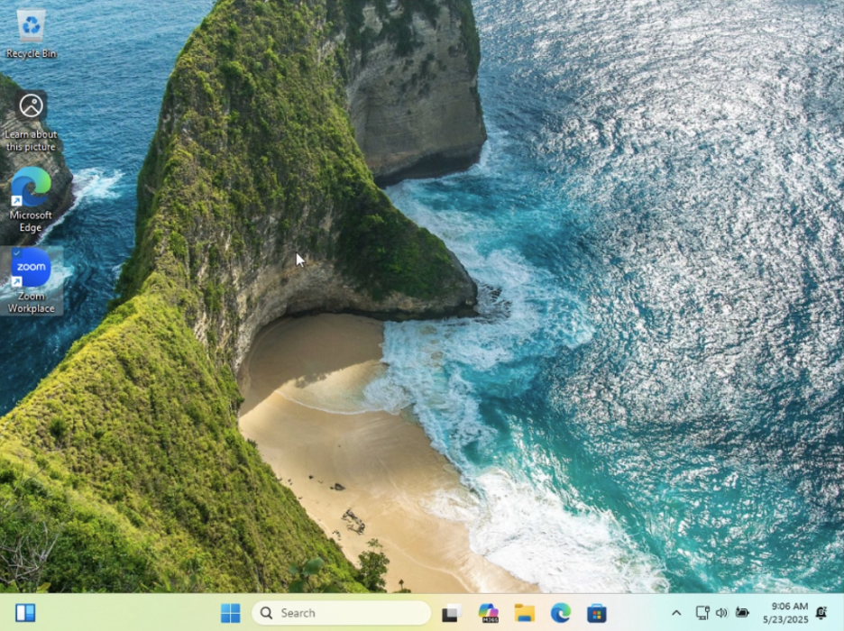
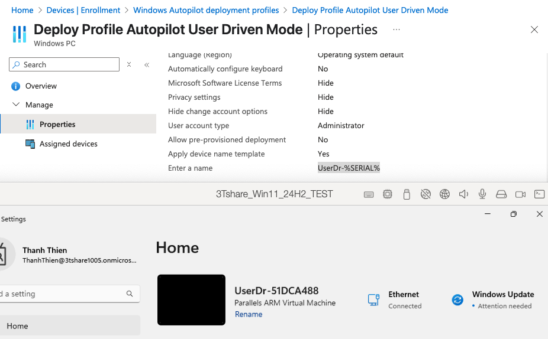

Day 1: Windows Autopilot User-Driven Mode 
=========================================

📌 Today we will discuss about Windows Autopilot with User-Driven Mode. This article provides an overview and step-by-step guidelines to perform a Windows Autopilot user-driven scenario when the devices are strictly Microsoft Entra joined. 
Link: `https://learn.microsoft.com/en-us/autopilot/tutorial/user-driven/azure-ad-join-workflow <https://learn.microsoft.com/en-us/autopilot/tutorial/user-driven/azure-ad-join-workflow>`_ 

.. image:: imgDay01/image.png
    :alt: Demo Image
    :width: 600px
    :align: center

I. Theory
---------

- **1/ What is autopilot user-driven mode**
    - Device is used by a single user
    - User-run deployment

    **Autopilot User-Driven Mode** lets end users set up their devices themselves with minimal IT involvement. After turning on the device and signing in, the device automatically joins the organization, enrolls in Intune, and applies company policies — ready for use. 
- **2/ When do we use user-driven mode** 
    - The device will be **delivered directly to the end users** without IT intervention
        - Requires no interaction from IT team/OEM/reseller. 
    - The device will be used primarily by **a single user** 
    - Doesn't require `TPM attestation <https://learn.microsoft.com/en-us/windows-server/identity/ad-ds/manage/component-updates/tpm-key-attestation>`_, so it works on physical devices and VMs. 

II. Deployment 
---------------

Step 1: Set up Windows automatic Intune enrollment
^^^^^^^^^^^^^^^^^^^^^^^^^^^^^^^^^^^^^^^^^^^^^^^^^^^^^^^^^^^^^^^^^^^^^^^^

    1/ Sign in to the `EntraID <https://entra.microsoft.com>`_

    .. image:: imgDay01/image1.png
        :alt: Demo Image
        :width: 600px
        :align: center

    2/ In the ``EntraID`` screen > search the keyword ``MDM and WIP,`` click on ``MDM and WIP``

    .. image:: imgDay01/image2.png
        :alt: Demo Image
        :width: 600px
        :align: center 

    3/ In ``Mobility (MDM and WIP)`` > choose ``Microsoft Intune``

    .. image:: imgDay01/image3.png
        :alt: Demo Image
        :width: 600px
        :align: center

    4/ In Microsoft Intune

        4.1/ MDM user scope

        - check ``All``

    .. image:: imgDay01/image4.png
        :alt: Demo Image
        :width: 600px
        :align: center 

        4.2/ Windows Information Protection(WIP) user scope

        - Check ``None``

    .. image:: imgDay01/image5.png
        :alt: Demo Image
        :width: 600px
        :align: center 

    5/ After settings like the picture above, select ``Save``

Step 2: Allow users to join devices to Microsoft Entra ID
^^^^^^^^^^^^^^^^^^^^^^^^^^^^^^^^^^^^^^^^^^^^^^^^^^^^^^^^^^^^^^^^^^^^^^^^

    1/ Sign in to the `Microsoft Entra ID <https://entra.microsoft.com>`_. 

    .. image:: imgDay01/image6.png
        :alt: Demo Image
        :width: 600px
        :align: center

    2/ In the ``EntraID`` screen, under ``Identity`` in the left hand pane, select ``Devices``. 

    .. image:: imgDay01/image7.png
        :alt: Demo Image
        :width: 600px
        :align: center

    3/ In the ``Devices | Overview`` screen, under ``Manage`` in the left hand pane, select ``Device Settings``. 

    .. image:: imgDay01/image8.png
        :alt: Demo Image
        :width: 600px
        :align: center

    4/ In the ``Devices | Device settings`` screen that opens, under ``Users may join devices to Microsoft Entra``, select ``All`` 

    .. image:: imgDay01/image9.png
        :alt: Demo Image
        :width: 600px
        :align: center

    5/ After settings > select ``Save``

Step 3: Create a device group
^^^^^^^^^^^^^^^^^^^^^^^^^^^^^^^^^^^^^^^^^^^^^^^^^^^^^^^^^^^^^^^^^^^^^^^^

    Create a dynamic device group for use with Windows Autopilot

    1/ Sign into the `Microsoft Intune admin center <https://go.microsoft.com/fwlink/?linkid=2109431>`_. 

    .. image:: imgDay01/image10.png
        :alt: Demo Image
        :width: 600px
        :align: center

    2/ In the Intune Admin Portal, select ``Groups,`` then select ``All groups``

    .. image:: imgDay01/image11.png
        :alt: Demo Image
        :width: 600px
        :align: center

    3/ In the ``Groups | Overview`` screen, make sure ``All groups`` is selected, and then select ``New group``. 

    .. image:: imgDay01/image12.png
        :alt: Demo Image
        :width: 600px
        :align: center 

    3/ In the ``New Group`` screen that opens:

    - For ``Group type``, select ``Security``. 
    - For ``Group name``, enter a name for the device group [``All Autopilot Device``] 
    - For ``Group description > skip`` 
    - For ``Microsoft Entra roles can be assigned to the group``, select ``No``. 
    - For ``Membership type``, select ``Dynamic Device``. 
    - For ``Owners >`` ``skip`` 
    - For ``Dynamic device members``, select ``Add dynamic query``. 
    The ``Dynamic membership rules`` screen opens. 

    .. image:: imgDay01/image13.png
        :alt: Demo Image
        :width: 600px
        :align: center

    4/ In the ``Dynamic membership rules`` screen

    4.1/ at the Rule syntax box, select edit at the top-right hand side

    .. image:: imgDay01/image14.png
        :alt: Demo Image
        :width: 600px
        :align: center 

    4.2/ Paste in the following rule in the ``Edit rule syntax`` screen under ``Rule syntax``

    `(device.devicePhysicalIDs -any (_ -startsWith "[ZTDid]"))`

    .. image:: imgDay01/image15.png
        :alt: Demo Image
        :width: 600px
        :align: center

    4.3/ Once the rule is pasted in, select ``OK``. 
    4.4/ Once the desired rule is entered, select ``Save`` on the toolbar to close the ``Dynamic membership rules`` window. 

    .. image:: imgDay01/image16.png
        :alt: Demo Image
        :width: 600px
        :align: center

    5/ Select ``Create`` to finish creating the dynamic device group. 

    .. image:: imgDay01/image17.png
        :alt: Demo Image
        :width: 600px
        :align: center

    6/ Wait until the notification is successful

    .. image:: imgDay01/image18.png
        :alt: Demo Image
        :width: 600px
        :align: center

Step 4: Configure and assign Windows Autopilot Enrollment Status Page (ESP)
^^^^^^^^^^^^^^^^^^^^^^^^^^^^^^^^^^^^^^^^^^^^^^^^^^^^^^^^^^^^^^^^^^^^^^^^

- ``What is ESP`` 
    ESP is often configured to wait for only specific apps (instead of all), so users can get to the desktop faster. 
- ``A. Upload A Package App`` 

    1/ Visit the link here: `Zoom Installers <https://support.zoom.com/hc/en/article?id=zm_kb&sysparm_article=KB0060407>`_

    2/ Download Zoom workspace desktop app for Meeting (64bit)- MSI Installer
    Or using the link here: `https://zoom.us/client/latest/ZoomInstallerFull.msi?archType=x64 <https://zoom.us/client/latest/ZoomInstallerFull.msi?archType=x64>`_

    .. image:: imgDay01/image19.png
        :alt: Demo Image 
        :width: 600px
        :align: center

    3/ Sign in to the `Microsoft Intune admin center <https://go.microsoft.com/fwlink/?linkid=2109431>`_. 
    4/ Select ``Apps`` > ``Apps | Overview`` > ``Windows``. 

    .. image:: imgDay01/image20.png
        :alt: Demo Image
        :width: 600px
        :align: center

    5/ In ``Windows | Windows Apps,`` select ``Create`` 

    .. image:: imgDay01/image21.png
        :alt: Demo Image
        :width: 600px
        :align: center

    6/ In the ``Select app type`` pane, under the ``Other`` app types, select ``Line-of-business app``. 

    .. image:: imgDay01/image22.png
        :alt: Demo Image
        :width: 600px
        :align: center

    7/ Select ``Select``. 
    The ``Add app`` steps are displayed. 

    .. image:: imgDay01/image23.png
        :alt: Demo Image
        :width: 600px
        :align: center

    8/ In the ``Add app`` pane, select ``Select app package file``. 

    .. image:: imgDay01/image24.png
        :alt: Demo Image
        :width: 600px
        :align: center

    9/ ``Upload`` the ``ZoomMSI`` file downloaded recently, select ``OK``

    .. image:: imgDay01/image25.png
        :alt: Demo Image 
        :width: 600px
        :align: center

    10/ In App information, select ``Next``

    - Name: ``Zoom``
    - Description: ``skip``
    - Publisher: ``Zoom``
    - App install context: ``Device`` 
    - Ignore app version: ``No`` 
    - Command-line arguments: `/qn` 
    - Upload Logo 
    - The other fields: ``skip`` 

    .. image:: imgDay01/image26.png
        :alt: Demo Image
        :width: 600px
        :align: center

    .. image:: imgDay01/image27.png
        :alt: Demo Image
        :width: 600px
        :align: center 

    11/ At the ``scope tags`` screen, select ``Next``

    .. image:: imgDay01/image28.png
        :alt: Demo Image
        :width: 600px
        :align: center 

    12/ At the Assignments screen, Assign to the desired group, select ``Next``

    12.1/ At the ``Required header,`` select ``add group`` 

    .. image:: imgDay01/image29.png
        :alt: Demo Image
        :width: 600px
        :align: center

    12.2/ Enter [``All Autopilot Device``], Check ``box``, click ``Select`` 

    .. image:: imgDay01/image30.png
        :alt: Demo Image
        :width: 600px
        :align: center

    12.3/ Ensure the target group is there, select ``Next`` 

    .. image:: imgDay01/image31.png
        :alt: Demo Image
        :width: 600px
        :align: center

    13/ At the review + Create tab, select create

    .. image:: imgDay01/image32.png
        :alt: Demo Image 
        :width: 600px
        :align: center

    14/ Wait until the uploading zoom is completed

    .. image:: imgDay01/image33.png
        :alt: Demo Image 
        :width: 600px
        :align: center

    15/ Wait until the uploading process is successful

    .. image:: imgDay01/image34.png
        :alt: Demo Image 
        :width: 600px
        :align: center

- ``B. Create ESP Profile`` 

    1/ Sign into the `Microsoft Intune admin center <https://go.microsoft.com/fwlink/?linkid=2109431>`_. 
    2/ In the ``Home`` screen, select ``Devices`` in the left hand pane. 

    .. image:: imgDay01/image35.png
        :alt: Demo Image
        :width: 600px
        :align: center

    3/ In the ``Devices | Overview`` screen, under ``Manage devices by platform``, select ``Windows``. 

    .. image:: imgDay01/image36.png
        :alt: Demo Image
        :width: 600px
        :align: center

    4/ In the ``Windows | Windows devices`` screen, under ``Device onboarding``, select ``Enrollment`` at the left pane side. 

    .. image:: imgDay01/image37.png
        :alt: Demo Image
        :width: 600px
        :align: center 

    5/ In the ``Windows | Windows enrollment`` screen, under ``Windows Autopilot``, select ``Enrollment Status Page``. 

    .. image:: imgDay01/image38.png
        :alt: Demo Image
        :width: 600px
        :align: center

    6/ In the ``Enrollment Status Page`` screen that opens, select ``Create``. 

    .. image:: imgDay01/image39.png
        :alt: Demo Image
        :width: 600px
        :align: center

    7/ The ``Create profile`` screen opens. 
    In the ``Basics`` page: 

    - Next to ``Name``, enter [ESP - Autopilot User-Driven Mode] 
    - Next to ``Description``, ``skip`` 
    - Select ``Next``. 

    .. image:: imgDay01/image40.png
        :alt: Demo Image
        :width: 600px
        :align: center 

    8/ In the ``Settings`` page, toggle the option ``Show app and profile configuration progress`` to ``Yes``. 

    .. image:: imgDay01/image41.png
        :alt: Demo Image
        :width: 600px
        :align: center

    8.1/ After toggling the setting to Yes > configure these settings following

    - Show an error when installation takes longer than specified number of minutes: ``60`` 
    - Show custom message when time limit or error occurs: ``Yes`` 
    - in the box message: [Installation exceeded the time limitation set by your organization. Please try again or contact your IT support person for help] 

    .. image:: imgDay01/image42.png
        :alt: Demo Image
        :width: 600px
        :align: center

    8.2/ After entering the message > turn on these settings below 

    - Turn on log collection and diagnostics page for end users: ``Yes`` 
    - Only show page to devices provisioned by out-of-box experience (OOBE): ``Yes`` 
    - Block device use until all apps and profiles are installed: ``Yes`` 
    - Allow users to reset device if installation error occurs: ``Yes`` 
    - Block device use until required apps are installed if they are assigned to the user/device: Selected 

    .. image:: imgDay01/image43.png
        :alt: Demo Image
        :width: 600px
        :align: center 

    8.2/ After choosing [``selected``] mode > click on ``+select apps`` 

    .. image:: imgDay01/image44.png
        :alt: Demo Image
        :width: 600px
        :align: center

    8.3/ At the ``Select apps`` > search ``Zoom`` > Click on Zoom and ``select`` 

    .. image:: imgDay01/image45.png
        :alt: Demo Image
        :width: 600px
        :align: center

    8.4/ Ensure ``Zoom`` is listed in the ``Blocking apps`` list > select ``Next`` 

    .. image:: imgDay01/image46.png
        :alt: Demo Image
        :width: 600px
        :align: center

    8.5/ After adding Zoom, at [Only fail selected blocking apps in technician phase] > Select ``No >`` then select ``Next`` 

    .. image:: imgDay01/image47.png
        :alt: Demo Image
        :width: 600px
        :align: center

    9/ at ``Assignment`` tab > click ``add groups`` 

    .. image:: imgDay01/image48.png
        :alt: Demo Image
        :width: 600px
        :align: center

    9.1/ At the select groups to include

    - Search [``All autopilot device``] 
    - ``Check`` ``box`` and click ``Select`` 

    .. image:: imgDay01/image49.png
        :alt: Demo Image
        :width: 600px
        :align: center

    10/ Ensure the target group is listed in the list, select ``Next`` 

    .. image:: imgDay01/image50.png
        :alt: Demo Image
        :width: 600px
        :align: center

    11/ At the scope tags, select ``Next`` 

    .. image:: imgDay01/image51.png
        :alt: Demo Image
        :width: 600px
        :align: center

    12/ At the ``Review and create`` tab, select ``Create`` 

    .. image:: imgDay01/image52.png
        :alt: Demo Image
        :width: 600px
        :align: center

    13/ Waiting until the notifications shows ``[profile successfully created /assigned]`` 

    .. image:: imgDay01/image53.png
        :alt: Demo Image
        :width: 600px
        :align: center

Step 5: Create and assign Windows Autopilot profile
^^^^^^^^^^^^^^^^^^^^^^^^^^^^^^^^^^^^^^^^^^^^^^^^^^^^^^^^^^^^^^^^^^^^^^^^

    1/ Sign into the `Microsoft Intune admin center <https://go.microsoft.com/fwlink/?linkid=2109431>`_. 
    2/ In the ``Home`` screen, select ``Devices`` in the left hand pane. 

    .. image:: imgDay01/image54.png
        :alt: Demo Image
        :width: 600px
        :align: center

    3/ In the ``Devices | Overview`` screen, under ``By platform``, select ``Windows``. 

    .. image:: imgDay01/image55.png
        :alt: Demo Image
        :width: 600px
        :align: center

    4/ In the ``Windows | Windows devices`` screen, under ``Device onboarding``, select ``Enrollment``. 

    .. image:: imgDay01/image56.png
        :alt: Demo Image
        :width: 600px
        :align: center

    5/ In the ``Windows | Windows enrollment`` screen, under ``Windows Autopilot``, select ``Deployment Profiles``. 

    .. image:: imgDay01/image57.png
        :alt: Demo Image
        :width: 600px
        :align: center

    6/ In the ``Windows Autopilot deployment profiles`` screen, select the ``Create Profile`` drop down menu and then select ``Windows PC``. 

    .. image:: imgDay01/image58.png
        :alt: Demo Image
        :width: 600px
        :align: center

    7/ The ``Create profile`` screen opens. 
    In the ``Basics`` page: 
        1. Next to ``Name``: [DeployProfile - Autopilot User-Driven Mode] 
        2. Next to ``Description`` 
        3. ``Next``. 

    .. image:: imgDay01/image59.png
        :alt: Demo Image
        :width: 600px
        :align: center 

    8.1/ In the ``Out-of-box experience (OOBE)`` page:

    - For ``Deployment mode``, select ``User-driven``. 
    - For ``Join to Microsoft Entra ID as``, select ``Microsoft Entra joined``. 
    - For ``Microsoft Software License Terms``, select ``Hide`` 
    - For ``Privacy settings``, select ``Hide`` 

    .. image:: imgDay01/image60.png
        :alt: Demo Image
        :width: 600px
        :align: center

    8.2/ In the ``Out-of-box experience (OOBE)`` page:

    - For ``Hide change account options``, select ``Hide``. 
    - For ``User account type``, select ``Administrator``. 
    - For ``Allow pre-provisioned deployment``, select ``No``. 
    - For ``Language (Region): Skip`` 
    - For ``Automatically configure keyboard: No`` 
    - For ``Apply device name template: UserDr-%SERIAL%`` 
    - Next 

    .. image:: imgDay01/image61.png
        :alt: Demo Image
        :width: 600px
        :align: center

    9/ In the ``Scope Tags`` tab, select ``Next`` 

    .. image:: imgDay01/image62.png
        :alt: Demo Image
        :width: 600px
        :align: center

    10/ In the ``Assignments`` tab
        - Under ``Included groups``, select ``Add groups``. 

    .. image:: imgDay01/image63.png
        :alt: Demo Image
        :width: 600px
        :align: center

    - select the group that created in the ``Step 3 [All Autopilot Device]`` 

    .. image:: imgDay01/image64.png
        :alt: Demo Image 
        :width: 600px
        :align: center

    - Next 
    11/ In the ``Assignments,`` click ``Create`` 

    .. image:: imgDay01/image65.png
        :alt: Demo Image
        :width: 600px
        :align: center 

    12/ Wait until the notification is successful

    .. image:: imgDay01/image66.png
        :alt: Demo Image
        :width: 600px
        :align: center

III. Admin Workflow 
--------------------

Before a device can use Windows Autopilot, the device must be registered as a Windows Autopilot device.  Registering a device as a Windows Autopilot device makes the Windows Autopilot service available to the device. 

Step 1: Register devices as Windows Autopilot devices
^^^^^^^^^^^^^^^^^^^^^^^^^^^^^^^^^^^^^^^^^^^^^^^^^^^^^^^^^^^^^^^^^^^^^^^^

    - We use the [upload hardware directly] method to register a target device into autopilot service
    1/ On a device that is currently undergoing Windows Setup and OOBE:
        a. At the select country and region screen, press keys ``Shift+F10.`` 

        .. image:: imgDay01/image67.png
            :alt: Demo Image
            :width: 600px
            :align: center

        b. The command prompt window will open 

        .. image:: imgDay01/image68.png
            :alt: Demo Image
            :width: 600px
            :align: center

        c. In the cmd windows, open PowerShell by running the following command: 

        .. code-block:: powershell
            :caption: PowerShell Command

            powershell.exe

        .. image:: imgDay01/image69.png
            :alt: Demo Image 
            :width: 600px
            :align: center

    2/ At the `PS` PowerShell command prompt, run the following PowerShell commands:
        - PowerShell 

        .. code-block:: powershell
            :caption: PowerShell Command

            Set-ExecutionPolicy -Scope Process -ExecutionPolicy RemoteSigned
            Install-Script -Name Get-WindowsAutopilotInfo -Force

        .. image:: imgDay01/image70.png
            :alt: Demo Image
            :width: 600px
            :align: center 

        - If prompted to do so, agree to install ``NuGet`` from the ``PSGallery,`` enter ``Yes`` (Y) 

        .. image:: imgDay01/image71.png
            :alt: Demo Image 
            :width: 600px
            :align: center

        - After install the module, run the commands below 

        .. code-block:: powershell
            :caption: PowerShell Command

            cd 'C:\Program Files\WindowsPowerShell\Scripts\' 
            powershell.exe -execution bypass Get-WindowsAutopilotInfo.ps1 -Online

        .. image:: imgDay01/image72.png
            :alt: Demo Image
            :width: 600px
            :align: center

    3/ When the last command of `Get-WindowsAutopilotInfo -Online` runs, a Microsoft Entra ID sign-on prompt is displayed. 
    Sign in with an account that is at least an Intune Administrator. 

    .. image:: imgDay01/image73.png
        :alt: Demo Image
        :width: 600px
        :align: center 

    .. image:: imgDay01/image74.png
        :alt: Demo Image
        :width: 600px
        :align: center

    4/ After the sign-in is successful, the device hash uploads automatically. 

    .. image:: imgDay01/image75.png
        :alt: Demo Image
        :width: 600px
        :align: center

    5/ Make sure that uploading hash is successful

Step 2: Verify device has a Windows Autopilot profile assigned to it
^^^^^^^^^^^^^^^^^^^^^^^^^^^^^^^^^^^^^^^^^^^^^^^^^^^^^^^^^^^^^^^^^^^^^^^^^^

    1/ Sign into the `Microsoft Intune admin center <https://go.microsoft.com/fwlink/?linkid=2109431>`_. 

    .. image:: imgDay01/image76.png
        :alt: Demo Image
        :width: 600px
        :align: center

    2/ In the ``Home`` screen, select ``Devices`` in the left hand pane. 

    .. image:: imgDay01/image77.png
        :alt: Demo Image
        :width: 600px
        :align: center

    3/ In the ``Devices | Overview`` screen, under ``By platform``, select ``Windows``. 

    .. image:: imgDay01/image78.png
        :alt: Demo Image
        :width: 600px
        :align: center

    4/ In the ``Windows | Windows devices`` screen, under ``Device onboarding``, select ``Enrollment``. 

    .. image:: imgDay01/image79.png
        :alt: Demo Image
        :width: 600px
        :align: center

    5/ In the ``Windows | Windows enrollment`` screen, under ``Windows Autopilot``, select ``Devices``. 

    .. image:: imgDay01/image80.png
        :alt: Demo Image
        :width: 600px
        :align: center

    6/ In the ``Windows Autopilot devices`` screen, select ``Sync`` in the toolbar. 

    .. image:: imgDay01/image81.png
        :alt: Demo Image
        :width: 600px
        :align: center

    7/ Wait for the sync to finish. 
    The sync might take several minutes. 

    .. image:: imgDay01/image82.png
        :alt: Demo Image
        :width: 600px
        :align: center

    8/ After the sync completes > Search the serial number of target device at the search bar 

    .. image:: imgDay01/image83.png
        :alt: Demo Image
        :width: 600px
        :align: center

    9/ Make sure the profile status is assigned like the picture above

IV. User Workflow OR User experience 
-------------------------------------

Registering a device as a Windows Autopilot device just makes the Windows Autopilot service available to the device.  Registering a device as a Windows Autopilot device doesn't mean that the device has used the Windows Autopilot service.  It just makes the Windows Autopilot service available to the device. 

Step 1: Deploy the device
^^^^^^^^^^^^^^^^^^^^^^^^^^^^^^^^^^^^^^^^^^^^^^^^^^^^^^^^^^^^^^^^^^^^^^^^^^^^^^^^^

1. Power on the device. 
2. The out-of-box experience (OOBE) begins and a screen asking for a country or region appears. 
Select the appropriate country or region, then select ``Yes``. 

    .. image:: imgDay01/image84.png
        :alt: Demo Image
        :width: 600px
        :align: center

3. The keyboard screen appears to select a keyboard layout. 
Select the appropriate keyboard layout, then select ``Yes``. 

    .. image:: imgDay01/image85.png
        :alt: Demo Image
        :width: 600px
        :align: center

4. An additional keyboard layouts screen appears, select ``Skip`` 

    .. image:: imgDay01/image86.png
        :alt: Demo Image
        :width: 600px
        :align: center

5. The ``Let's connect you to a network`` screen appears. 
At this screen, either plug the device into a wired network (if available), or select and connect to a wireless Wi-Fi network. 

    .. image:: imgDay01/image87.png
        :alt: Demo Image
        :width: 600px
        :align: center

6. Once network connectivity is established, the ``Next`` button should become available. 
Select ``Next``. 
7. At this point, the device might reboot to apply critical security updates (if available or applicable). 
After the reboot to apply critical security updates, the Windows Autopilot process begins. 

    .. image:: imgDay01/image88.png
        :alt: Demo Image
        :width: 600px
        :align: center

    .. image:: imgDay01/image89.png
        :alt: Demo Image
        :width: 600px
        :align: center

8. Once the Windows Autopilot process begins, the Microsoft Entra sign-in page appears, Sign-in with your ``org account,`` select ``Sign in`` 

    .. image:: imgDay01/image90.png
        :alt: Demo Image
        :width: 600px
        :align: center

9. After authenticating with Microsoft Entra ID, the Enrollment Status Page (ESP) appears. 
The Enrollment Status Page (ESP) displays progress during the provisioning process across three phases: 
    - ``Device preparation`` (Device ESP) 
    - ``Device setup`` (Device ESP) 
    - ``Account setup`` (User ESP) 

    The first two phases of ``Device preparation`` and ``Device setup`` are part of the Device ESP while the final phase of ``Account setup`` is part of the User ESP. 

    .. image:: imgDay01/image91.png
        :alt: Demo Image
        :width: 600px
        :align: center

10. Once ``Account setup`` and the user ESP process completes, the provisioning process completes, the ESP finishes, and the desktop appears. 
At this point, the end-user can start using the device. 

    .. image:: imgDay01/image92.png
        :alt: Demo Image
        :width: 600px
        :align: center

- Ensure the device already has the Zoom app installed, you can see it it the desktop screen Day 1: Windows Autopilot User-Driven Mode

11. You can check the hostname, make sure that the device name follows the format `UserDr-%SERIAL%` 

V. References
-----------------

- https://learn.microsoft.com/en-us/autopilot/troubleshooting-faq#why-is-the-join-type-for-a-device-showing-as--microsoft-entra-registered--instead-of--microsoft-entra-joined--
- `https://learn.microsoft.com/en-us/autopilot/add-devices <https://learn.microsoft.com/en-us/autopilot/add-devices>`_