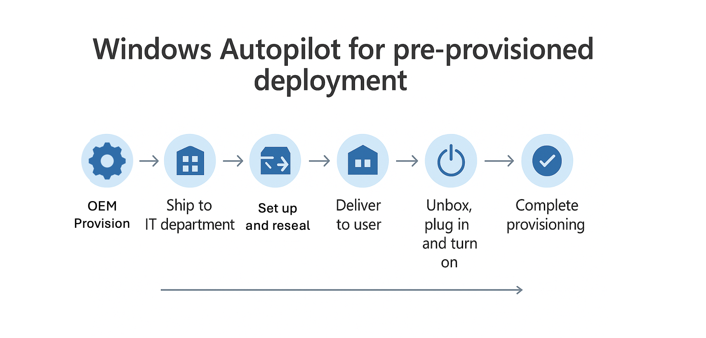

Day 2: Windows Autopilot for pre-provisioned deployment
=========================================================

.. admonition:: 📌 Today, we’ll explore Windows Autopilot with Pre-provisioned deployment. This article provides an overview along with step-by-step guidance to help you understand and implement the process effectively.
   :class: tip

   Link: https://learn.microsoft.com/en-us/autopilot/tutorial/user-driven/azure-ad-join-workflow

I. Theory
----------

* **1/ What is autopilot with pre-provisioned deployment mode**
    * Designed for a device used by a single user
    * Deployment is split between IT admin/OEM/reseller and user
    * **Autopilot Pre-Provisioning Mode** allows IT to set up and fully configure devices before handing them to end users. Devices are provisioned with apps, policies, and settings in advance, so users can simply sign in and start working — minimizing setup time and improving user experience.
* **2/ When do we use user-driven mode**
    * The device will be **setup fully by IT team** before being delivered to end-users
        * The end-user only needs to perform a minimal number of actions during the deployment process, so that the deployment is faster than the user-driven mode
        * Suitable when you want to **minimize user involvement during the OOBE steps**
    * The device will be used primarily by **a single user**
* **3/ Requirements and Preparation**
    * Physical devices that support **Trusted Platform Module (TPM) 2.0 and device attestation.**
    * Windows Pro, Enterprise, or Education editions.
    * To be ready to try out Windows Autopilot for pre-provisioned deployment, make sure that existing Windows Autopilot user-driven scenarios can be successfully used: *(visit link here….)*

II. Deployment
--------------------

* **Step 1: Set up Windows automatic Intune enrollment**

    1/ Sign in to the `EntraID <https://entra.microsoft.com>`_

    .. image:: imgDay02/image0.png
        :alt: EntraID Sign-in
        :width: 600px
        :align: center

    2/ In the **EntraID** screen > search the keyword **MDM and WIP** > click on **MDM and WIP**

    .. image:: imgDay02/image1.png
        :alt: Search MDM and WIP
        :width: 600px
        :align: center

    3/ In **Mobility (MDM and WIP)** > ****choose **Microsoft Intune**

    .. image:: imgDay02/image2.png
        :alt: Choose Microsoft Intune
        :width: 600px
        :align: center

    4/ In Microsoft Intune

    4.1/ MDM user scope

    - check **All**

    .. image:: imgDay02/image3.png
        :alt: MDM user scope All
        :width: 600px
        :align: center

    4.2/ Windows Information Protection(WIP) user scope

    - Check **None**

    .. image:: imgDay02/image4.png
        :alt: WIP user scope None
        :width: 600px
        :align: center

    5/ After setting like the picture above **select** > **Save**

* **Step 2: Allow users to join devices to Microsoft Entra ID**

    1/ Sign in to the `Microsoft Entra ID <https://entra.microsoft.com>`_.

    .. image:: imgDay02/image5.png
        :alt: Microsoft Entra ID Sign-in
        :width: 600px
        :align: center

    2/ In the **EntraID** screen, under **Identity** in the left hand pane, select **Devices**.

    .. image:: imgDay02/image6.png
        :alt: Select Devices in EntraID
        :width: 600px
        :align: center

    3/ In the **Devices | Overview** screen, under **Manage** in the left hand pane, select **Device Settings**.

    .. image:: imgDay02/image7.png
        :alt: Select Device Settings
        :width: 600px
        :align: center

    4/ In the **Devices | Device settings** screen that opens, under **Users may join devices to Microsoft Entra**, select **All**

    .. image:: imgDay02/image8.png
        :alt: Users may join devices to Microsoft Entra
        :width: 600px
        :align: center

    5/ Save

* **Step 3: Create a device group**

    Create a dynamic device group for use with Windows Autopilot

    1/ Sign into the `Microsoft Intune admin center <https://go.microsoft.com/fwlink/?linkid=2109431>`_.

    .. image:: imgDay02/image9.png
        :alt: Microsoft Intune admin center Sign-in
        :width: 600px
        :align: center

    2/ In the Intune Admin Portal > select **Groups > All groups**

    .. image:: imgDay02/image10.png
        :alt: Groups All groups
        :width: 600px
        :align: center

    3/ In the **Groups | Overview** screen > make sure **All groups** is selected, and then select **New group**.

    .. image:: imgDay02/image11.png
        :alt: New group in Groups Overview
        :width: 600px
        :align: center

    3/ In the **New Group** screen that opens:

    - For **Group type**, select **Security**.
    - For **Group name**, enter a name for the device group [`All Autopilot Device`]
    - For **Group description > skip**
    - For **Microsoft Entra roles can be assigned to the group**, select **No**.
    - For **Membership type**, select **Dynamic Device**.
    - For **Owners >** **skip**
    - For **Dynamic device members**, select **Add dynamic query**. The **Dynamic membership rules** screen opens.

    .. image:: imgDay02/image12.png
        :alt: New Group screen
        :width: 600px
        :align: center

    4/ In the **Dynamic membership rules** screen

    4.1/ at the Rule syntax box > select edit at the top-right hand side (highlight area)

    4.2/ Paste in the following rule in the **Edit rule syntax** screen under **Rule syntax**

    ``(device.devicePhysicalIDs -any (_ -startsWith "[ZTDid]"))``

    .. image:: imgDay02/image13.png
        :alt: Dynamic membership rules syntax
        :width: 600px
        :align: center

    4.3/ Once the rule is pasted in, select **OK**.

    4.4/ Once the desired rule is entered, select **Save** on the toolbar to close the **Dynamic membership rules** window.

    .. image:: imgDay02/image14.png
        :alt: Dynamic membership rules save
        :width: 600px
        :align: center

    5/ Select **Create** to finish creating the dynamic device group.

    6/ Wait until the notification is successful

* **Step 4: Configure and assign Windows Autopilot Enrollment Status Page (ESP) (Edit)**
    * ***What is ESP (shortly - copy day1)***

        ESP is often configured to wait for only specific apps (instead of all), so users can get to the desktop faster.

    * **A. Upload A Package App**

        1/ Visit the link here: `Zoom Installers <https://support.zoom.com/hc/en/article?id=zm_kb&sysparm_article=KB0060407>`_

        2/ Download Zoom workspace desktop app for Meeting (64bit)- MSI Installer
        Or using the link here: https://zoom.us/client/latest/ZoomInstallerFull.msi?archType=x64

        .. image:: imgDay02/image15.png
            :alt: Zoom installer download
            :width: 600px
            :align: center

        3/ Sign in to the `Microsoft Intune admin center <https://go.microsoft.com/fwlink/?linkid=2109431>`_.

        2/ Select **Apps** > **Apps | Overview** > **Windows**.

        .. image:: imgDay02/image16.png
            :alt: Apps Windows selection
            :width: 600px
            :align: center

        3/ In **Windows | Windows Apps** > select **Create**

        .. image:: imgDay02/image17.png
            :alt: Create app in Windows Apps
            :width: 600px
            :align: center

        4/ In the **Select app type** pane, under the **Other** app types, select **Line-of-business app**.

        .. image:: imgDay02/image18.png
            :alt: Select app type
            :width: 600px
            :align: center

        4/ Select **Select**. The **Add app** steps are displayed.

        .. image:: imgDay02/image19.png
            :alt: Add app steps
            :width: 600px
            :align: center

        5/ In the **Add app** pane, select **Select app package file**.

        .. image:: imgDay02/image20.png
            :alt: Select app package file
            :width: 600px
            :align: center

        6/ **Upload** the **ZoomMSI** file downloaded recently, select **OK**

        .. image:: imgDay02/image21.png
            :alt: Upload Zoom MSI
            :width: 600px
            :align: center

        7/ In App information > select **Next**

        - Name: **Zoom**
        - Description: **skip**
        - Publisher: **Zoom**
        - App install context: **Device**
        - Ignore app version: **No**
        - Command-line arguments: ``/qn``
        - Upload Logo
        - The other fields: **skip**

        .. image:: imgDay02/image22.png
            :alt: App information
            :width: 600px
            :align: center

        .. image:: imgDay02/image23.png
            :alt: App information continued
            :width: 600px
            :align: center

        8/ At the **scope tags** screen > select Next

        .. image:: imgDay02/image24.png
            :alt: Scope tags
            :width: 600px
            :align: center

        9/ At the Assignments screen > Assign to the desired group > select Next

        9.1/ At the **Required header** > select **add group**

        .. image:: imgDay02/image25.png
            :alt: Add group for assignments
            :width: 600px
            :align: center

        9.2/ Enter [**All Autopilot Device**] > Check **box** > click **Select**

        .. image:: imgDay02/image26.png
            :alt: Select All Autopilot Device group
            :width: 600px
            :align: center

        9.3/ Ensure the target group is there > select **Next**

        .. image:: imgDay02/image27.png
            :alt: Target group selected
            :width: 600px
            :align: center

        10/ At the review + Create tab > select create

        .. image:: imgDay02/image28.png
            :alt: Review and Create app
            :width: 600px
            :align: center

        11/ Wait until the uploading zoom is completed

        .. image:: imgDay02/image29.png
            :alt: Zoom upload in progress
            :width: 600px
            :align: center

        12/ uploading process is successful

        .. image:: imgDay02/image30.png
            :alt: Zoom upload successful
            :width: 600px
            :align: center

    * **B. Create ESP Profile**

        1/ Sign into the `Microsoft Intune admin center <https://go.microsoft.com/fwlink/?linkid=2109431>`_.

        2/ In the **Home** screen, select **Devices** in the left hand pane.

        .. image:: imgDay02/image31.png
            :alt: Devices in Intune home
            :width: 600px
            :align: center

        3/ In the **Devices | Overview** screen, under **Manage devices by platform**, select **Windows**.

        .. image:: imgDay02/image32.png
            :alt: Devices Windows platform
            :width: 600px
            :align: center

        4/ In the **Windows | Windows devices** screen, under **Device onboarding**, select **Enrollment** at the left pane side.

        .. image:: imgDay02/image33.png
            :alt: Windows Enrollment
            :width: 600px
            :align: center

        5/ In the **Windows | Windows enrollment** screen, under **Windows Autopilot**, select **Enrollment Status Page**.

        .. image:: imgDay02/image34.png
            :alt: Enrollment Status Page selection
            :width: 600px
            :align: center

        6/ In the **Enrollment Status Page** screen that opens, select **Create**.

        .. image:: imgDay02/image35.png
            :alt: Create ESP
            :width: 600px
            :align: center

        7/ The **Create profile** screen opens. In the **Basics** page:

        - Next to **Name**, enter [ESP - Autopilot Pre-Provision Mode]
        - Next to **Description**, **skip**
        - Select **Next**.

        .. image:: imgDay02/image36.png
            :alt: Create ESP profile basics
            :width: 600px
            :align: center

        8/ In the **Settings** page, toggle the option **Show app and profile configuration progress** to **Yes**.

        .. image:: imgDay02/image37.png
            :alt: ESP settings
            :width: 600px
            :align: center

        8.1/ After toggling the setting to Yes > configure these settings following

        - Show an error when installation takes longer than specified number of minutes: **60**
        - Show custom message when time limit or error occurs: **Yes**
        - in the box message: *[Installation exceeded the time limitation set by your organization. Please try again or contact your IT support person for help]*

        .. image:: imgDay02/image38.png
            :alt: ESP custom message
            :width: 600px
            :align: center

        8.2/ After entering the message > turn on these settings below

        - Turn on log collection and diagnostics page for end users: **Yes**
        - Only show page to devices provisioned by out-of-box experience (OOBE): **Yes**
        - Block device use until all apps and profiles are installed: **Yes**
        - Allow users to reset device if installation error occurs: **Yes**
        - Block device use until required apps are installed if they are assigned to the user/device: Selected

        .. image:: imgDay02/image39.png
            :alt: ESP blocking apps settings
            :width: 600px
            :align: center

        8.2/ After choosing [**selected**] mode > click on **+select apps**

        .. image:: imgDay02/image40.png
            :alt: Select apps for ESP
            :width: 600px
            :align: center

        8.3/ At the **Select apps** > search **Zoom** > Click on Zoom and **select**

        .. image:: imgDay02/image41.png
            :alt: Selecting Zoom app
            :width: 600px
            :align: center

        8.3/ Ensure **Zoom** is listed in the **Blocking apps** list > select **Next**

        .. image:: imgDay02/image42.png
            :alt: Zoom listed in blocking apps
            :width: 600px
            :align: center

        8.4/ After adding Zoom, at [Only fail selected blocking apps in technician phase] > Select **No >** then select **Next**

        .. image:: imgDay02/image43.png
            :alt: Blocking apps in technician phase setting
            :width: 600px
            :align: center

        9/ at **Assignment** tab > click **add groups**

        .. image:: imgDay02/image44.png
            :alt: Add groups for ESP assignment
            :width: 600px
            :align: center

        9.1/ At the select groups to include

        - Search [**All autopilot device**]
        - **Check** **box** and click **Select**

        .. image:: imgDay02/image45.png
            :alt: Selecting All Autopilot Device group for ESP
            :width: 600px
            :align: center

        10/ Ensure the target group is listed in the list > select **Next**

        .. image:: imgDay02/image46.png
            :alt: ESP target group listed
            :width: 600px
            :align: center

        11/ At the scope tags > select **Next**

        .. image:: imgDay02/image47.png
            :alt: ESP scope tags
            :width: 600px
            :align: center

        12/ At the **Review and create** tab > select **Create**

        .. image:: imgDay02/image48.png
            :alt: ESP Review and Create
            :width: 600px
            :align: center

        13/ Waiting until the notifications shows **[profile successfully created /assigned]**

        .. image:: imgDay02/image49.png
            :alt: ESP profile creation success notification
            :width: 600px
            :align: center

        - Ensure that the new profile is listed in the list like the picture below

        .. image:: imgDay02/image50.png
            :alt: New ESP profile listed
            :width: 600px
            :align: center

* **Step 5: Create and assign Windows Autopilot profile (Edit)**
    1.  Sign into the `Microsoft Intune admin center <https://go.microsoft.com/fwlink/?linkid=2109431>`_.
    2.  In the **Home** screen, select **Devices** in the left hand pane.

    .. image:: imgDay02/image51.png
        :alt: Devices in Intune home
        :width: 600px
        :align: center

    3.  In the **Devices | Overview** screen, under **By platform**, select **Windows**.

    .. image:: imgDay02/image52.png
        :alt: Devices Windows platform
        :width: 600px
        :align: center

    4.  In the **Windows | Windows devices** screen, under **Device onboarding**, select **Enrollment**.

    .. image:: imgDay02/image53.png
        :alt: Windows Enrollment
        :width: 600px
        :align: center

    5.  In the **Windows | Windows enrollment** screen, under **Windows Autopilot**, select **Deployment Profiles**.

    .. image:: imgDay02/image54.png
        :alt: Deployment Profiles
        :width: 600px
        :align: center

    6.  In the **Windows Autopilot deployment profiles** screen, select the **Create Profile** drop down menu and then select **Windows PC**.

    .. image:: imgDay02/image55.png
        :alt: Create Profile dropdown
        :width: 600px
        :align: center

    7.  The **Create profile** screen opens. In the **Basics** page:
        1.  **Name:** [**Deploy Profile Autopilot Preprovision Mode**]
        2.  **Description**
        3.  **Convert all targeted devices to Autopilot**: No
        4.  **Next**.

    .. image:: imgDay02/image56.png
        :alt: Create Autopilot profile basics
        :width: 600px
        :align: center

    8.1. In the **Out-of-box experience (OOBE)** page:

    - For **Deployment mode**, select **User-driven**.
    - For **Join to Microsoft Entra ID as**, select **Microsoft Entra joined**.
    - For **Microsoft Software License Terms**, select **Hide**
    - For **Privacy settings**, select **Hide**

    .. image:: imgDay02/image57.png
        :alt: OOBE settings 1
        :width: 600px
        :align: center

    8.2. In the **Out-of-box experience (OOBE)** page:

    - For **Hide change account options**, select **Hide**.
    - For **User account type**, select **Administrator**.
    - For **Allow pre-provisioned deployment**, select **Yes**.
    - For **Language (Region):** Operating system defaults
    - For **Automatically configure keyboard: No**
    - For **Apply device name template: PrePro-%SERIAL%**
    - **Next**

    .. image:: imgDay02/image58.png
        :alt: OOBE settings 2
        :width: 600px
        :align: center

    1.  In the **Scope Tags** tab > **Next**

    .. image:: imgDay02/image59.png
        :alt: Autopilot profile scope tags
        :width: 600px
        :align: center

    2.  In the **Assignments** tab
        - Under **Included groups**, select **Add groups**.

        .. image:: imgDay02/image60.png
            :alt: Add groups for Autopilot profile assignment
            :width: 600px
            :align: center

        - select the group that created in the **Step 3 [All Autopilot Device]**

        .. image:: imgDay02/image61.png
            :alt: Selecting All Autopilot Device group
            :width: 600px
            :align: center

        - Next
    3.  In the **Assignments** > **Create**

    .. image:: imgDay02/image62.png
        :alt: Review and Create Autopilot profile
        :width: 600px
        :align: center

    4.  Wait until the notification is successful

    .. image:: imgDay02/image63.png
        :alt: Autopilot profile creation success notification
        :width: 600px
        :align: center

    .. image:: imgDay02/image64.png
        :alt: Autopilot profile listed
        :width: 600px
        :align: center

III. Admin Workflow
--------------------

Before a device can use Windows Autopilot, the device must be registered as a Windows Autopilot device.

* **Step 1: Register devices as Windows Autopilot devices (new - physical device)**
    * We use the [*upload hardware directly*] method to register a target device into autopilot service
    1.  On a device that is:
        -   Currently undergoing Windows Setup and OOBE:
            1.  At the sign-in prompt after OOBE starts, open a command prompt window with the keystroke **Shift+F10.**
            2.  In the command prompt window that opens, start PowerShell by running the following command:

                Windows Command Prompt

                ::

                    powershell.exe

        -   Already undergone Windows Setup and OOBE:
            1.  Sign into the device.
            2.  Open an elevated Windows PowerShell prompt.
    2.  At the ``PS`` PowerShell command prompt, run the following PowerShell commands:
        -   PowerShell

            ::

                [Net.ServicePointManager]::SecurityProtocol = [Net.SecurityProtocolType].Tls12
                Set-ExecutionPolicy -Scope Process -ExecutioPolicy RemoteSigned
                Install-Script -Name Get-WindowsAutopilotInfo -Force

        -   If prompted to do so, agree to install **NuGet** from the **PSGallery** > Yes (Y)

        .. image:: imgDay02/image65.png
            :alt: NuGet installation prompt
            :width: 600px
            :align: center

        -   After install the module > run the commands below

            ::

                 cd 'C:\Program Files\WindowsPowerShell\Scripts\'
                 powershell -execution bypass Get-WindowsAutopilotInfo -Online

        .. image:: imgDay02/image66.png
            :alt: Get-WindowsAutopilotInfo -Online command
            :width: 600px
            :align: center

    3.  When the last command of ``Get-WindowsAutopilotInfo -Online`` runs, a Microsoft Entra ID sign-on prompt is displayed. Sign in with an account that is at least an Intune Administrator.

    .. image:: imgDay02/image67.png
        :alt: Microsoft Entra ID sign-on
        :width: 600px
        :align: center

    4.  After the sign-in is successful, the device hash uploads automatically. (edit different SN and hash)

    .. image:: imgDay02/image68.png
        :alt: Device hash upload successful
        :width: 600px
        :align: center

* **Step 2: Verify device has a Windows Autopilot profile assigned to it ||** Verify the hardware hash uploaded. **(edit match device hash)**

    To confirm the hardware hash for the device was uploaded into Intune and that the device shows as a Windows Autopilot device:

    1.  Sign into the `Microsoft Intune admin center <https://go.microsoft.com/fwlink/?linkid=2109431>`_.

    .. image:: imgDay02/image69.png
        :alt: Intune admin center sign-in
        :width: 600px
        :align: center

    2.  In the **Home** screen, select **Devices** in the left hand pane.

    .. image:: imgDay02/image70.png
        :alt: Devices in Intune home
        :width: 600px
        :align: center

    3.  In the **Devices | Overview** screen, under **By platform**, select **Windows**.

    .. image:: imgDay02/image71.png
        :alt: Devices Windows platform
        :width: 600px
        :align: center

    4.  In the **Windows | Windows devices** screen, under **Device onboarding**, select **Enrollment**.

    .. image:: imgDay02/image72.png
        :alt: Windows Enrollment
        :width: 600px
        :align: center

    5.  In the **Windows | Windows enrollment** screen, under **Windows Autopilot**, select **Devices**.

    .. image:: imgDay02/image73.png
        :alt: Autopilot Devices
        :width: 600px
        :align: center

    6.  In the **Windows Autopilot devices** screen, select **Sync** in the toolbar.

    .. image:: imgDay02/image74.png
        :alt: Sync button in Autopilot devices
        :width: 600px
        :align: center

    7.  Wait for the sync to finish. The sync might take several minutes.

    .. image:: imgDay02/image75.png
        :alt: Sync completion
        :width: 600px
        :align: center

    8.  After the sync completes > Search the serial number of target device at the search bar

    .. image:: imgDay02/image76.png
        :alt: Search bar for serial number
        :width: 600px
        :align: center

    .. image:: imgDay02/image77.png
        :alt: Search results for serial number
        :width: 600px
        :align: center

    9.  Wait until the profile status is assigned

    .. image:: imgDay02/image78.png
        :alt: Profile status assigned
        :width: 600px
        :align: center

1.  Make sure the profile name that is **Deploy Profile Autopilot Preprovision Mode** created lately

    .. image:: imgDay02/image79.png
        :alt: Autopilot profile name verification
        :width: 600px
        :align: center

IV. User Workflow || User experience
----------------------------------------

Registering a device as a Windows Autopilot device doesn't mean that the device has used the Windows Autopilot service. It just makes the Windows Autopilot service available to the device.

* **Step 1: `Deploy the device <https://learn.microsoft.com/en-us/autopilot/tutorial/user-driven/azure-ad-join-deploy-device>`_**
    1.  Power on the device.
    2.  The out-of-box experience (OOBE) begins and a screen asking for a country or region appears. Select the appropriate country or region > and then select **Yes**.

    .. image:: imgDay02/image80.png
        :alt: OOBE country/region selection
        :width: 600px
        :align: center

    3.  The keyboard screen appears to select a keyboard layout. Select the appropriate keyboard layout > and then select **Yes**.

    .. image:: imgDay02/image81.png
        :alt: OOBE keyboard layout selection
        :width: 600px
        :align: center

    4.  An additional keyboard layouts screen appears > select **Skip**

    .. image:: imgDay02/image82.png
        :alt: OOBE skip additional keyboard layouts
        :width: 600px
        :align: center

    5.  The **Let's connect you to a network** screen appears. At this screen, either plug the device into a wired network (if available), or select and connect to a wireless Wi-Fi network.

    .. image:: imgDay02/image83.png
        :alt: OOBE network connection
        :width: 600px
        :align: center

    6.  Once network connectivity is established, the **Next** button should become available. Select **Next**.
    7.  At this point, the device might reboot to apply critical security updates (if available or applicable). After the reboot to apply critical security updates, the Windows Autopilot process begins.

    .. image:: imgDay02/image84.png
        :alt: Windows Autopilot process starting
        :width: 600px
        :align: center

    .. image:: imgDay02/image85.png
        :alt: Windows Autopilot process
        :width: 600px
        :align: center

    8.  Once the Windows Autopilot process begins, the Microsoft Entra sign-in page appears. > Sign-in with your org account > then select Sign in

    .. image:: imgDay02/image86.png
        :alt: Microsoft Entra sign-in page
        :width: 600px
        :align: center

    9.  After authenticating with Microsoft Entra ID, the Enrollment Status Page (ESP) appears. The Enrollment Status Page (ESP) displays progress during the provisioning process across three phases:
        -   **Device preparation** (Device ESP)
        -   **Device setup** (Device ESP)
        -   **Account setup** (User ESP)

        The first two phases of **Device preparation** and **Device setup** are part of the Device ESP while the final phase of **Account setup** is part of the User ESP.

    .. image:: imgDay02/image87.png
        :alt: Enrollment Status Page
        :width: 600px
        :align: center

    10. Once **Account setup** and the user ESP process completes, the provisioning process completes, the ESP finishes, and the desktop appears. At this point, the end-user can start using the device.

    .. image:: imgDay02/image88.png
        :alt: Desktop after provisioning
        :width: 600px
        :align: center

* **Step 2: Post-Check**
    -   Verify Computer name > The name format is correct as desired

    .. image:: imgDay02/image89.png
        :alt: Computer name verification
        :width: 600px
        :align: center

    -   Verify Admin rights

    .. image:: imgDay02/image90.png
        :alt: Admin rights verification
        :width: 600px
        :align: center

    -   verify installed apps > Zoom already installed

    .. image:: imgDay02/image91.png
        :alt: Installed Zoom app
        :width: 600px
        :align: center

    -   verify managed devices using ``dsreg /status``

    .. image:: imgDay02/image92.png
        :alt: dsreg /status output
        :width: 600px
        :align: center

V. References
--------------

* https://learn.microsoft.com/en-us/autopilot/pre-provision
* https://learn.microsoft.com/en-us/autopilot/tutorial/pre-provisioning/azure-ad-join-workflow
* https://techcommunity.microsoft.com/blog/intunecustomersuccess/updates-to-the-windows-autopilot-sign-in-and-deployment-experience/2848452